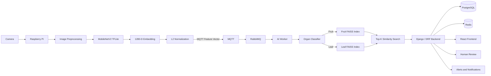

<div align="center">

# Smart Tomato Disease Monitoring

### Edge-IoT and Edge AI Platform for Intelligent Tomato Plant Monitoring

<br>


<br><br>

An end-to-end Edge-IoT system designed to monitor tomato plants through embedded image acquisition, lightweight Edge AI, vector similarity search, asynchronous messaging, backend services, real-time supervision, alerting, and human review.

<br>

| Images Evaluated | Classes | Organ Routing Accuracy | Global Label Accuracy |
|:---:|:---:|:---:|:---:|
| **6,383** | **15** | **98.70%** | **90.46%** |

</div>

---

# Table of Contents

- [Project Overview](#project-overview)
- [Problem Statement](#problem-statement)
- [Project Objectives](#project-objectives)
- [System Architecture](#system-architecture)
- [End-to-End Processing Flow](#end-to-end-processing-flow)
- [Edge Node](#edge-node)
- [Edge AI Pipeline](#edge-ai-pipeline)
- [Vector-First Communication Strategy](#vector-first-communication-strategy)
- [Messaging Architecture](#messaging-architecture)
- [AI Worker and Vector Inference](#ai-worker-and-vector-inference)
- [Backend Architecture](#backend-architecture)
- [Frontend and Supervision Platform](#frontend-and-supervision-platform)
- [Evidence Image Retrieval](#evidence-image-retrieval)
- [AI Evaluation Results](#ai-evaluation-results)
- [Technology Stack](#technology-stack)
- [Repository Structure](#repository-structure)
- [Deployment](#deployment)
- [Continuous Integration](#continuous-integration)
- [Current Limitations](#current-limitations)
- [Future Improvements](#future-improvements)
- [Author](#author)

---

# Project Overview

This project was developed as a final-year Master's project in collaboration with **AZURA / MARAISSA**.

Its objective is to design and implement an intelligent monitoring system capable of assisting the supervision of tomato plants using computer vision, embedded systems, IoT communication, and artificial intelligence.

The solution is based on an Edge-IoT architecture in which image processing starts directly on a Raspberry Pi located near the monitored environment.

Instead of systematically transmitting raw images to the central platform, the Edge node extracts a compact numerical representation of each image and sends this representation to the central AI infrastructure.

The central platform then performs organ routing, vector similarity search, disease analysis, inspection creation, alert generation, and supervision.

The complete system therefore connects several engineering domains:

- embedded systems;
- computer vision;
- Edge AI;
- IoT communication;
- asynchronous messaging;
- vector databases and similarity search;
- backend development;
- real-time communication;
- web supervision;
- human review;
- containerized deployment.

---

# Problem Statement

Plant disease monitoring in agricultural environments is traditionally based on manual observation.

This approach presents several limitations:

- monitoring depends on human availability;
- visual inspection can be inconsistent;
- large cultivation areas are difficult to inspect continuously;
- symptoms may not be detected early enough;
- images and observations are not always systematically archived;
- manual inspection provides limited traceability.

The purpose of this project is not simply to build an image classifier.

The objective is to create a complete monitoring architecture capable of connecting a field device to a central intelligent supervision platform.

The system must therefore handle the entire lifecycle of an inspection:

```text
Image acquisition
        |
        v
Embedded preprocessing
        |
        v
Feature extraction
        |
        v
IoT transmission
        |
        v
AI processing
        |
        v
Backend ingestion
        |
        v
Inspection creation
        |
        v
Alert generation
        |
        v
Dashboard visualization
        |
        v
Optional human review
````

---

# Project Objectives

The system was designed around several main objectives.

## Embedded Processing

Perform part of the image-processing pipeline directly on the Raspberry Pi in order to reduce dependency on a powerful central machine for basic visual feature extraction.

## Network Efficiency

Avoid transmitting complete images for every inspection.

The system follows a vector-first approach in which compact numerical embeddings are transmitted first.

## Modular AI Pipeline

Separate feature extraction, organ routing, and disease similarity search into independent components.

This makes the pipeline easier to maintain, evaluate, and evolve.

## Asynchronous Communication

Use MQTT and RabbitMQ to decouple the Edge device from central processing services.

## Central Supervision

Provide a web platform capable of managing:

* inspections;
* devices;
* disease information;
* alerts;
* human review;
* monitoring;
* geographical visualization.

## Traceability

Store inspection results and associate AI predictions with their corresponding device, timestamp, location, confidence scores, and optional evidence images.

---

# System Architecture

The project uses a distributed architecture composed of an Edge layer, messaging layer, AI processing layer, backend layer, and supervision layer.



The architecture intentionally separates responsibilities between the Edge device and the central platform.

The Raspberry Pi is responsible for:

```text
Image acquisition
Image preprocessing
MobileNetV2 inference
Embedding generation
L2 normalization
MQTT publication
Local evidence-image retention
```

The central infrastructure is responsible for:

```text
Organ classification
FAISS vector search
Disease similarity analysis
Inspection management
Alert generation
Human review
Data persistence
Dashboard visualization
```

---

# End-to-End Processing Flow

A normal inspection follows several stages.

## 1. Image Capture

The Raspberry Pi captures an image using the camera connected to the Edge node.

## 2. Preprocessing

The image is prepared for the feature-extraction model.

## 3. Feature Extraction

A TensorFlow Lite version of MobileNetV2 generates a compact feature representation.

The output is a vector containing:

```text
1,280 dimensions
```

## 4. L2 Normalization

The embedding is normalized before transmission.

This ensures that the vectors are represented consistently inside the vector space used by the similarity-search pipeline.

## 5. MQTT Publication

The Raspberry Pi creates a structured payload containing information such as:

```text
device_id
image_id
timestamp
feature_dim
feature_vector
vector_norm
l2_normalized
message_type
```

The payload is transmitted through MQTT.

## 6. RabbitMQ Routing

RabbitMQ acts as the messaging infrastructure between the Edge device and the AI Worker.

The AI Worker consumes inference requests through AMQP.

## 7. Organ Routing

The AI Worker executes a lightweight organ classifier.

The objective is to determine whether the captured image represents:

```text
Fruit
```

or:

```text
Leaf
```

The predicted organ determines which FAISS search index will be used.

## 8. Vector Similarity Search

The feature vector is compared to reference embeddings using FAISS.

Two independent search spaces are maintained:

```text
Fruit FAISS index
Leaf FAISS index
```

Separating both indexes avoids meaningless comparisons between fruit and leaf images.

## 9. Top-K Retrieval

The system retrieves the most similar reference vectors.

The default configuration uses:

```text
Top K = 5
```

The returned neighbors contain labels and similarity information that are used to construct the inference result.

## 10. Backend Ingestion

The AI Worker sends the processed result to the Django backend.

## 11. Inspection Creation

The backend stores the inspection and related AI matches.

## 12. Supervision

The inspection becomes available through the React supervision platform.

Depending on its result and confidence, the inspection can trigger:

* an alert;
* a notification;
* a human-review request;
* an evidence-image request.

---

# Edge Node

The Edge device is based on a **Raspberry Pi 4**.

Its main role is to acquire visual information and execute lightweight inference close to the data source.

## Main Responsibilities

The Edge runtime performs:

```text
Camera acquisition
Image preprocessing
TFLite inference
Feature-vector generation
Vector normalization
Payload generation
MQTT publication
Evidence-image handling
```

The relevant runtime scripts are located under:

```text
ai_assets/edge_runtime/
```

Important files include:

```text
requirements-edge.txt

scripts/
    pi_extract_and_publish.py
    pi_evidence_image_agent.py
    evidence_image_utils.py
```

## Edge Dependencies

The Edge environment includes:

```text
NumPy
Pillow
LiteRT
Paho MQTT
Requests
```

FAISS and the organ/disease decision logic are deliberately not executed on the Raspberry Pi.

This keeps the Edge runtime lighter and preserves the separation between local feature extraction and central intelligent analysis.

---

# Edge AI Pipeline

The Edge AI component uses **MobileNetV2** as a visual feature extractor.

## Why MobileNetV2

MobileNetV2 was selected because it offers a suitable balance between:

* computational cost;
* model size;
* visual representation quality;
* compatibility with embedded hardware.

The feature extractor used by the project is exported to TensorFlow Lite.

The repository contains:

```text
ai_assets/models/mobilenetv2_feature_extractor.tflite
```

The model produces an embedding of:

```text
1,280 floating-point values
```

Instead of sending the full image into the central AI pipeline, this representation becomes the primary data exchanged between the Edge and backend infrastructure.

---

# Vector-First Communication Strategy

One of the main architectural decisions of the project is the use of a **vector-first communication strategy**.

A traditional architecture may work as follows:

```text
Camera
   |
   v
Full Image
   |
   v
Network
   |
   v
Central Server
   |
   v
Image Processing
```

The architecture implemented in this project works differently:

```text
Camera
   |
   v
Raspberry Pi
   |
   v
MobileNetV2
   |
   v
1280-D Embedding
   |
   v
MQTT
   |
   v
Central AI Pipeline
```

The original image can remain temporarily available on the Edge device.

It is transmitted only when required by the backend.

This strategy separates two types of communication:

```text
Routine AI processing
        =
Feature-vector transmission

Visual evidence
        =
On-demand image transmission
```

The approach reduces unnecessary full-image transfers while preserving access to the original image when an inspection requires visual confirmation.

---

# Messaging Architecture

Communication between system components is based on MQTT and RabbitMQ.

## MQTT

MQTT is used for communication with the Edge node.

The Raspberry Pi publishes feature-vector payloads using MQTT.

The system also uses MQTT command topics to request evidence images from specific Edge devices.

## RabbitMQ

RabbitMQ acts as the central message broker.

The project enables both:

```text
MQTT communication
AMQP communication
```

The AI Worker consumes messages through AMQP.

The Docker configuration includes RabbitMQ with the MQTT plugin enabled.

## Inference Queue

The AI Worker listens to a dedicated inference queue:

```text
tomato.ai.inference.requests.v1
```

A routing pattern is used for Edge feature vectors:

```text
tomato.edge.v1.*.feature-vector
```

## Dead-Letter Handling

The AI Worker configuration also contains dedicated dead-letter infrastructure.

This allows failed messages to be isolated instead of silently discarded.

The project defines:

```text
Dead-letter exchange
Dead-letter queue
Dead-letter routing key
```

This improves the reliability and observability of the asynchronous processing pipeline.

---

# AI Worker and Vector Inference

The central AI Worker is responsible for processing vector-based inference requests.

The main components are located under:

```text
ai_assets/ai_worker/
```

and:

```text
ai_assets/ai_engine/
```

Important modules include:

```text
consumer.py
payload_validator.py
result_sink.py
vector_inference_service.py
```

## Payload Validation

Before inference, incoming payloads are validated.

Required fields include:

```text
device_id
message_type
image_id
feature_dim
l2_normalized
feature_vector
```

The pipeline verifies that the feature vector contains exactly:

```text
1,280 dimensions
```

It also checks:

* vector shape;
* NaN values;
* infinite values;
* normalization state.

If the input vector is not sufficiently close to unit norm, an L2-normalized copy is generated before retrieval.

---

# Organ Routing

A Logistic Regression classifier is used to route incoming embeddings toward the appropriate disease-search index.

The classifier returns:

```text
predicted organ
organ probability
routing status
```

The system can return:

```text
fruit
leaf
unknown
```

If the classifier confidence is lower than the configured threshold, the image is marked as requiring review instead of being automatically routed.

The default AI Worker configuration uses:

```text
minimum organ probability = 0.70
```

---

# FAISS Similarity Search

After organ routing, the feature vector is sent to one of two FAISS indexes.

```text
Fruit image
    |
    v
fruit_faiss.index
```

```text
Leaf image
    |
    v
leaf_faiss.index
```

The system retrieves the closest reference vectors and returns information such as:

```text
Top-1 label
Top-1 score
Majority label
Nearest neighbors
Index used
Processing status
```

The AI pipeline also checks whether the Top-1 prediction and majority vote agree.

When they disagree, the inspection can be flagged for review.

---

# AI Development and Evaluation Tools

The repository includes dedicated scripts for building, evaluating, and analyzing the AI pipeline.

Examples include:

```text
extract_embeddings.py
export_mobilenetv2_tflite.py
train_organ_classifier.py
validate_organ_router.py

build_faiss.py
build_organ_router.py
build_balanced_organ_router.py

generate_evaluation_report.py
analyze_evaluation_errors.py
export_error_cases.py

compare_keras_vs_tflite.py
compare_image_vs_vector_pipeline.py

run_local_ai_pipeline.py
run_vector_ai_pipeline.py
```

These tools support the full AI lifecycle:

```text
Dataset preparation
        |
        v
Feature extraction
        |
        v
Model export
        |
        v
Organ classifier training
        |
        v
FAISS index generation
        |
        v
Pipeline evaluation
        |
        v
Error analysis
```

---

# Backend Architecture

The backend is implemented using:

```text
Django
Django REST Framework
Django Channels
PostgreSQL
Redis
```

The backend is divided into several Django applications.

```text
backend/apps/

accounts/
catalog/
core/
devices/
inference/
inspections/
monitoring/
notifications/
review/
vectors/
```

This modular structure separates the main responsibilities of the platform.

## Accounts

Handles users, authentication, and account-related functionality.

Authentication uses JWT through:

```text
djangorestframework-simplejwt
```

## Devices

Manages registered Edge devices and their associated location information.

## Catalog

Stores information about tomato diseases and their associated metadata.

## Inspections

Represents monitoring events generated by the AI pipeline.

The inspection system stores AI results and related similarity matches.

## Notifications

Handles alerts and notification workflows.

## Review

Supports human validation and correction of AI-generated inspections.

## Monitoring

Provides system monitoring functionality.

---

# Real-Time Communication

The backend uses:

```text
Django Channels
Redis
```

for WebSocket-based real-time communication.

This enables the supervision interface to receive updates without requiring continuous manual page refreshes.

Real-time functionality is used particularly for notifications and dashboard synchronization.

---

# Frontend and Supervision Platform

The frontend is implemented using React.

The application includes:

```text
React
Vite
Material UI
React Query
React Router
Leaflet
Recharts
Zustand
```

The frontend is structured into feature-oriented modules.

```text
frontend/src/features/

account/
auth/
catalog/
dashboard/
devices/
inspections/
map/
monitoring/
notifications/
review/
```

## Dashboard

Provides a global overview of system activity.

## Inspections

Displays AI inspection results and their associated details.

## Disease Map

Provides geographical visualization of inspection and disease information.

## Notifications

Displays generated alerts and system events.

## Review

Provides a workspace for inspections requiring human validation.

## Devices

Allows management and supervision of registered Edge devices.

## Catalog

Provides access to the disease catalog used by the platform.

---

# Human Review Workflow

AI decisions are not treated as infallible.

The system includes a human-review workflow.

Inspections can enter different review states:

```text
pending
confirmed
corrected
```

A review may be triggered when:

* organ confidence is too low;
* AI results are uncertain;
* retrieved neighbors disagree;
* visual evidence is required.

This workflow allows human operators to validate or correct an inspection while preserving the original AI output for traceability.

---

# Evidence Image Retrieval

The platform implements an on-demand evidence-image mechanism.

The default processing path transmits only feature vectors.

When the backend requires the original image, it publishes an image request command targeted at the corresponding Edge device.

The process is:

```text
Backend
   |
   v
RabbitMQ
   |
   v
MQTT Command
   |
   v
Raspberry Pi
   |
   v
Evidence Agent
   |
   v
Original Image Upload
   |
   v
Backend
   |
   v
Inspection / Alert
```

Relevant Raspberry Pi code is located in:

```text
ai_assets/edge_runtime/scripts/pi_evidence_image_agent.py
```

The mechanism allows the system to preserve the benefits of vector-first communication without losing access to the original visual evidence.

---

# Alerting

The platform includes severity-based alerting.

When a disease or anomaly requires user attention, an inspection can generate:

```text
Dashboard notification
Real-time notification
Email notification
Evidence-image association
```

Disease severity information is derived from the disease catalog.

This keeps alerting logic connected to the actual health risk represented by the detected condition.

---

# AI Evaluation Results

The AI pipeline was evaluated using:

```text
6,383 images
15 classes
```

The evaluation uses FAISS similarity search over MobileNetV2 visual embeddings.

## Global Results

| Metric                     |     Result |
| -------------------------- | ---------: |
| Images evaluated           |  **6,383** |
| Organ accuracy             | **98.70%** |
| Global label accuracy      | **90.46%** |
| Fruit accuracy             | **87.43%** |
| Leaf accuracy              | **95.80%** |
| Top-1 / Majority agreement | **93.56%** |

The organ-routing component demonstrated a high ability to distinguish fruit images from leaf images.

Leaf classes achieved better overall performance than fruit classes in the evaluated dataset.

---

# Per-Class Evaluation

Selected results from the evaluation include:

| Organ | Class              |   Accuracy |
| ----- | ------------------ | ---------: |
| Leaf  | Early Blight       | **99.00%** |
| Leaf  | Healthy            | **99.00%** |
| Leaf  | Late Blight        | **99.00%** |
| Leaf  | Bushy Stunt        | **95.00%** |
| Leaf  | Leaf Curl          | **87.00%** |
| Fruit | Healthy            | **96.82%** |
| Fruit | Bacterial Spot     | **94.09%** |
| Fruit | Late Blight        | **90.91%** |
| Fruit | Target Spot        | **89.94%** |
| Fruit | Mold               | **89.02%** |
| Fruit | Anthracnose        | **88.46%** |
| Fruit | Spotted Wilt Virus | **85.19%** |

The evaluation also identified weaker classes.

These cases are useful because they reveal where the reference dataset and visual representation need improvement.

---

# Identified Weak Classes

Some classes presented lower performance.

| Class           |   Accuracy |
| --------------- | ---------: |
| Catfaced        | **46.90%** |
| Fruit Cracking  | **61.35%** |
| Blossom End Rot | **77.17%** |
| Leaf Curl       | **87.00%** |

The main causes identified during evaluation include:

* limited reference samples;
* visual similarity between different disorders;
* subtle visual defects;
* class imbalance;
* confusion with visually healthy samples.

These results are important because the system is designed to support future dataset enrichment without requiring a complete redesign of the architecture.

---

# Technology Stack

<div align="center">

<table width="100%">

<tr>

<td width="33%" align="center">

### Edge


<br><br>

Raspberry Pi 4
Python
TensorFlow Lite / LiteRT
MobileNetV2
Pillow
Paho MQTT

</td>

<td width="33%" align="center">

### AI


&nbsp;

&nbsp;


<br><br>

FAISS
Scikit-learn
NumPy
Pandas
Logistic Regression

</td>

<td width="33%" align="center">

### Messaging

<br>

RabbitMQ
MQTT
AMQP
Pika

</td>

</tr>

<tr>

<td width="33%" align="center">

### Backend


<br><br>

Django
Django REST Framework
Django Channels
PostgreSQL
Redis
JWT

</td>

<td width="33%" align="center">

### Frontend


<br><br>

React
Vite
Material UI
React Query
Leaflet
Recharts
Zustand

</td>

<td width="33%" align="center">

### Infrastructure


<br><br>

Docker
Docker Compose
Traefik
GitHub Actions

</td>

</tr>

</table>

</div>

---

# Repository Structure

```text
projet-tomate-monitoring/
│
├── ai_assets/
│   │
│   ├── ai_engine/
│   │   └── vector_inference_service.py
│   │
│   ├── ai_worker/
│   │   ├── config.py
│   │   ├── consumer.py
│   │   ├── payload_validator.py
│   │   └── result_sink.py
│   │
│   ├── edge_runtime/
│   │   ├── requirements-edge.txt
│   │   └── scripts/
│   │       ├── pi_extract_and_publish.py
│   │       ├── pi_evidence_image_agent.py
│   │       └── evidence_image_utils.py
│   │
│   ├── models/
│   │   ├── mobilenetv2_feature_extractor.tflite
│   │   ├── organ_classifier_logreg.pkl
│   │   └── organ_classifier_labels.json
│   │
│   ├── indexes/
│   │   ├── fruit_faiss.index
│   │   ├── leaf_faiss.index
│   │   └── organ_faiss.index
│   │
│   ├── metadata/
│   │
│   └── scripts/
│       ├── extract_embeddings.py
│       ├── build_faiss.py
│       ├── train_organ_classifier.py
│       ├── validate_organ_router.py
│       ├── generate_evaluation_report.py
│       └── analyze_evaluation_errors.py
│
├── backend/
│   │
│   ├── apps/
│   │   ├── accounts/
│   │   ├── catalog/
│   │   ├── core/
│   │   ├── devices/
│   │   ├── inference/
│   │   ├── inspections/
│   │   ├── monitoring/
│   │   ├── notifications/
│   │   ├── review/
│   │   └── vectors/
│   │
│   ├── config/
│   ├── Dockerfile
│   ├── requirements.txt
│   └── manage.py
│
├── frontend/
│   │
│   ├── src/
│   │   ├── features/
│   │   │   ├── account/
│   │   │   ├── auth/
│   │   │   ├── catalog/
│   │   │   ├── dashboard/
│   │   │   ├── devices/
│   │   │   ├── inspections/
│   │   │   ├── map/
│   │   │   ├── monitoring/
│   │   │   ├── notifications/
│   │   │   └── review/
│   │   │
│   │   ├── components/
│   │   └── store/
│   │
│   ├── Dockerfile
│   └── package.json
│
├── .github/
│   └── workflows/
│       └── ci.yml
│
├── .dockerignore
├── .gitattributes
├── .gitignore
└── docker-compose.yaml
```

---

# Docker Architecture

The complete central platform is orchestrated using Docker Compose.

The current stack contains:

```text
Traefik
PostgreSQL
Redis
RabbitMQ
AI Worker
Django Backend
React Frontend
```

## Traefik

Traefik acts as the reverse proxy.

It routes:

```text
/api/*              -> Django Backend
/admin/*            -> Django Backend
/media/*            -> Django Backend
/static/*           -> Django Backend
/ws/notifications   -> Django Backend
/*                  -> React Frontend
```

## PostgreSQL

Stores persistent application data.

## Redis

Supports Django Channels and real-time communication.

## RabbitMQ

Handles MQTT and AMQP message transport.

## AI Worker

Consumes feature-vector inference requests and communicates processed results to the backend.

## Backend

Runs Django through Daphne in ASGI mode.

## Frontend

The React application is built using Vite and exposed through Traefik.

---

# Local Deployment

## Prerequisites

The central platform requires:

```text
Git
Docker
Docker Compose
```

Clone the repository:

```bash
git clone https://github.com/medbaihich/projet-tomate-monitoring.git
cd projet-tomate-monitoring
```

Start the complete platform:

```bash
docker compose up --build
```

Docker Compose will initialize the required infrastructure and application services.

---

# Backend Development

The backend dependencies are stored in:

```text
backend/requirements.txt
```

A development environment file template is available at:

```text
backend/.env.example
```

The backend uses environment variables for configuration such as:

```text
Django configuration
PostgreSQL connection
Redis connection
RabbitMQ connection
Evidence-image commands
Email configuration
```

---

# Frontend Development

Install dependencies:

```bash
cd frontend
npm install
```

Start the Vite development server:

```bash
npm run dev
```

Available frontend scripts include:

```text
npm run dev
npm run build
npm run lint
npm run test
```

---

# Continuous Integration

The project includes a GitHub Actions workflow:

```text
.github/workflows/ci.yml
```

The workflow validates both frontend and backend components.

## Frontend CI

```text
Checkout
    |
    v
Node.js 20
    |
    v
npm ci
    |
    v
ESLint
    |
    v
Production Build
```

## Backend CI

```text
Checkout
    |
    v
Python 3.12
    |
    v
PostgreSQL
    |
    +--> Redis
    |
    v
Install Dependencies
    |
    v
Django Test Suite
```

The backend tests cover multiple modules including:

```text
accounts
catalog
core
devices
inference
inspections
monitoring
notifications
review
vectors
```

---

# Current Limitations

The current prototype has several known limitations.

## Dataset Balance

Some disease classes contain significantly fewer reference examples than others.

This directly affects retrieval quality for underrepresented classes.

## Similar Visual Symptoms

Some diseases and anomalies exhibit similar visual patterns, which can produce confusion inside the embedding space.

## Capture Conditions

Image quality can be affected by:

* lighting;
* capture angle;
* blur;
* occlusion;
* greenhouse conditions.

## Edge Hardware Consumption

A Raspberry Pi provides significantly more processing capacity than a microcontroller, but also requires more energy.

## Network Dependency

The current deployment relies mainly on Wi-Fi connectivity.

Agricultural environments may require alternative communication technologies depending on coverage and infrastructure.

---

# Future Improvements

Several improvements can extend the current architecture.

## Dataset Expansion

Increase the number of examples for weak or underrepresented classes.

## Dataset Rebalancing

Reduce class imbalance to improve the reliability of similarity-based decisions.

## Image Quality Validation

Introduce automatic quality checks before an image is accepted by the AI pipeline.

Possible criteria include:

```text
Brightness
Blur
Image sharpness
Occlusion
```

## Improved Edge Optimization

Further reduce Edge inference time and memory consumption.

## Additional Communication Technologies

Evaluate alternative field communication technologies depending on deployment conditions.

## Improved AI Models

Experiment with other lightweight feature extractors while preserving compatibility with embedded execution.

## Extended Monitoring

Add more system-level telemetry for:

```text
Edge device health
Network status
Processing latency
Message queues
Inference statistics
```

---

# Project Status

The current repository represents a functional end-to-end prototype.

| Component                      |    Status   |
| ------------------------------ | :---------: |
| Raspberry Pi image acquisition | Implemented |
| MobileNetV2 feature extraction | Implemented |
| 1,280-D embeddings             | Implemented |
| L2 normalization               | Implemented |
| MQTT communication             | Implemented |
| RabbitMQ integration           | Implemented |
| AI Worker                      | Implemented |
| Organ routing                  | Implemented |
| FAISS similarity search        | Implemented |
| Django backend                 | Implemented |
| PostgreSQL persistence         | Implemented |
| React supervision platform     | Implemented |
| Real-time notifications        | Implemented |
| Human review                   | Implemented |
| Evidence-image retrieval       | Implemented |
| Email alerts                   | Implemented |
| Dockerized deployment          | Implemented |
| GitHub Actions CI              | Implemented |

---

# Author

<div align="center">

### Mohamed BAIHICH

Embedded Systems | IoT | Edge AI

Final-year Master's project developed in collaboration with **AZURA / MARAISSA**

<br>

<a href="https://github.com/medbaihich">

</a>

<a href="https://www.linkedin.com/in/mohamed-baihich/">

</a>

</div>
